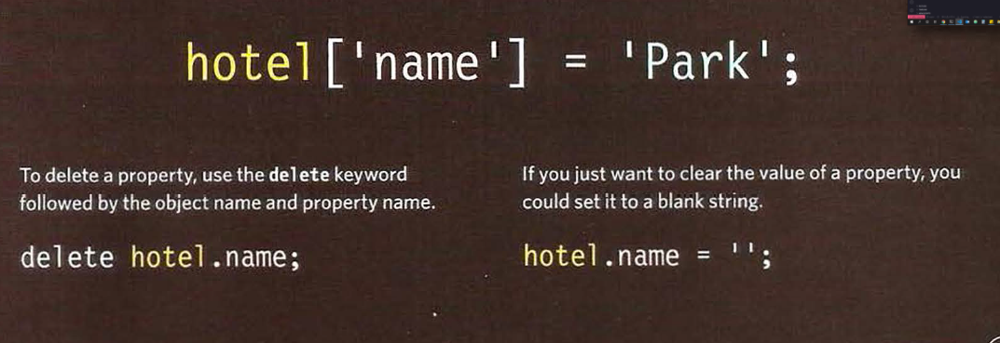

# Chapter 3:WHAT IS AN OBJECT?
## How to create objects in JS?
### Construtor notation 
#### the **new** keyword and the object constructor create a blank object.you can the add properties and methods to the objects.

### To update the valuses of properties, use dot notation or square brackets. They work on objects created using literal or constructor notation.To delete property, use the delete keyword.

