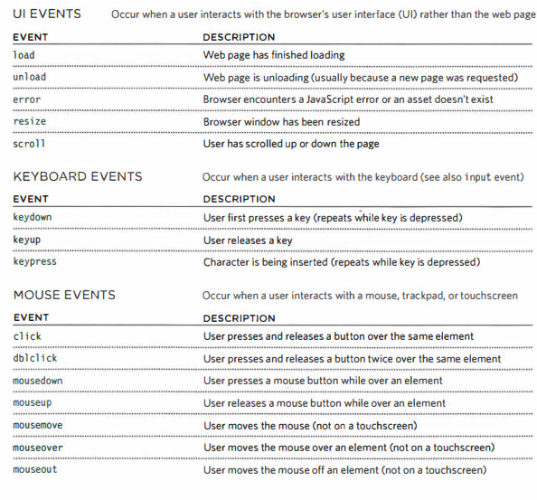
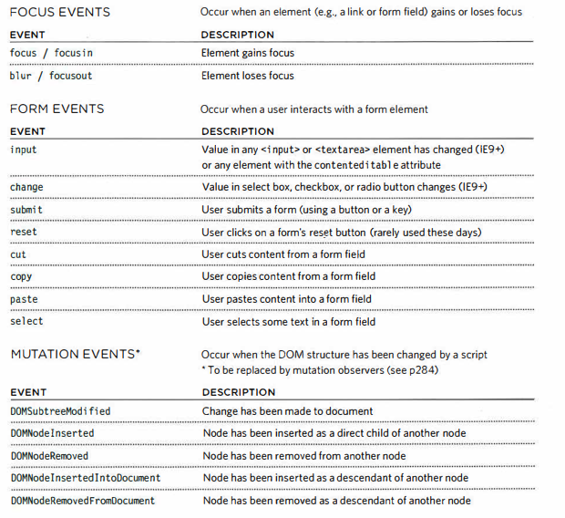

# Chapter 6: Events

## DIFFERENT EVENT TYPES
### Here is a selection of the events that occur in the browser while you are browsing the web. Any of these events can be used to trigger a function in your JavaScript code

## TERMINOLOGY
### EVENTS FIRE OR ARE R AISED
#### When an event has occurred, it is often described as having fired or been raised. In the diagram on the right, if the user is tapping on a link, a click event would fire in the browser.
### EVENTS TRIGGER SCRIPTS
#### Events are said to trigger a function or script. When the click event fires on the element in this diagram, it could trigger a script that enlarges the selected item

## HOW EVENTS TRIGGER JAVASCRIPT CODE
### When the user interacts with the HTML on a web page, there are three steps involved in getting it to trigger some JavaScript code. Together these steps are known as event handling