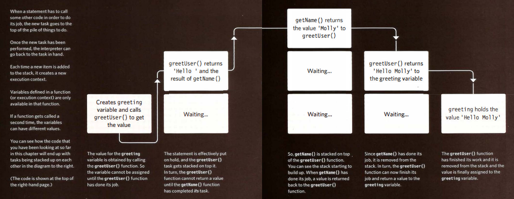
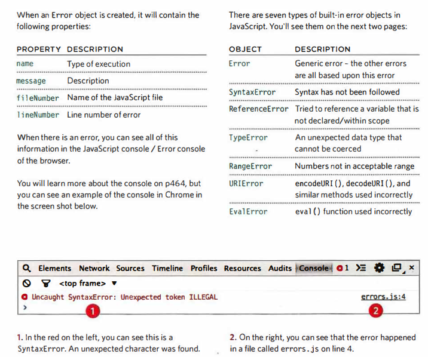
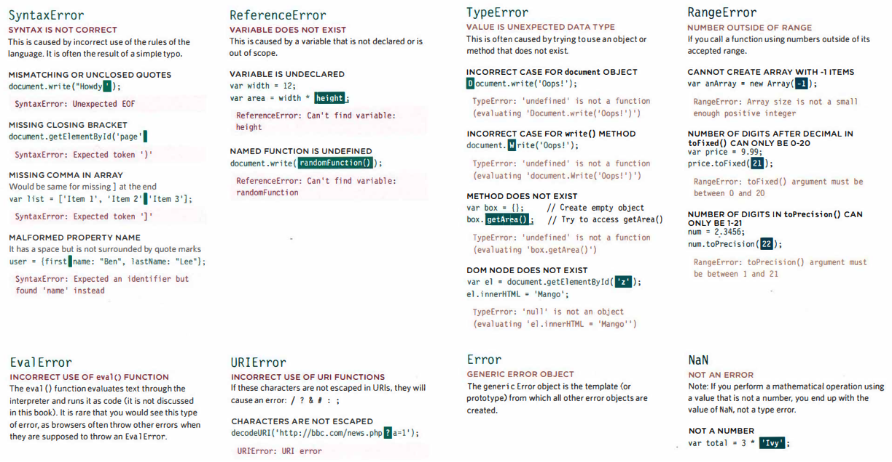

# Chapter 10: Error Handling & Debugging
> When you are writing JavaScript, do not expect to write it perfectly the first time. Programming is like problem solving: you are given a puzzle and not only do you have to solve it, but you also need to create the instructions that allow the computer to solve it, too.

## Order of Execution 

### To find the source of an error, it helps to know how scripts are processed. The order in which statements are executed can be complex; some tasks cannot complete until another statement or function has been run:

## Excution Contexts

### The JavaScript interpreter uses the concept of **execution contexts**. There is one global execution context; plus, each function creates a new new execution context. They correspond to variable scope.

## The Stack

### The JavaScribt interpreter processes onr line of code at a time.When a statement needs data from another function, it **stacks** (or piles) the new function on top of the current task.

## EXECUTION CONTEXT & HOISTING

### Each time a script enters a new execution context, there are two phases of activity:

1: PREPARE | 2: EXECUTE
---------- | ----------
The new scope is created   Variables, functions, and arguments are created   The value of the this keyword is determined | Now it can assign values to variables   Reference functions and run their code   Execute statements

## UNDERSTANDING SCOPE

### In the interpreter, each execution context has its own variables object. It holds the variables, functions, and parameters available within it. Each execution context can also access its parent's v ariab1 es object.

## ERROR OBJECTS

### Error objects can help you find where your mistakes are and browsers have tools to help you read them.

### Error Example:

 

## HOW TO DEAL WITH ERRORS?

  - 1: DEBUG THE SCRIPT TO FIX ERRORS
  - 2: HANDLE ERRORS GRACEFULLY :You can handle errors gracefully using try, catch throw, and fi na1 ly statements

## A DEBUGGING WORKFLOW

### Debugging is about deduction: eliminating potential causes of an error

#### WHERE IS THE PROBLEM?

#### First, should try to can narrow down the area where the problem seems to be. In a long script, this is
especially important.
   1. Look at the error message, it tells you:
     * The relevant script that caused the problem. 
     * The line number where it became a problem for the interpreter. (As you will see, the cause of the error may be earlier in a script; but this is the point at which the script could not continue.)
     * The type of error (although the underlying cause of the error may be different).
   2. Check how far the script is running. 
     * Use tools to write messages to the console to tell how far your script has executed.
   3. Use breakpoints where things are going wrong. They let you pause execution and inspect the values that are stored in variables

#### WHAT EXACTLY IS THE PROBLEM?

#### Once you think that you might know the rough area in which your problem is located, you can then try to find the actual line of code that is causing the error.

1. When you have set breakpoints, you can see if the variables around them have the values you would expect them to. If not. look earlier in the script.
2. Break down I break out parts of the code to test smaller pieces of the functionality.
  * Write values of variables into the console.
  * Call functions from the console to check if they are returning what you would expect them to.
  * Check if objects exist and have the methods / properties that you think they do.
3. Check the number of parameters for a function, or the number of items in an array.

> If the problem is hard to find, it is easy to lose track of what you have and have not tested. Therefore,
when you start debugging, keep notes of what you have tested and what the result was. No matter how stressful the circumstances are, if you can, stay calm and methodical, the problem will feel less overwhelming and you will solve it faster.

## BROWSER DEV TOOLS & JAVASCRIPT CONSOLE

## The JavaScript console will tell you when there is a problem with a script,where to look for the problem, and what kind of issue it seems to be.

## HANDLING EXCEPTIONS
### If you know your code might fail, use try, catch, and finally. Each one is given its own code block.

`try {`
`Try to execute this code`
`}`
`catch (exception) {`
`If there is an exception, run this code`
`}`
`finally {`
`This always gets executed`
`}`

## THROWING ERRORS
### If you know something might cause a problem for your script, you can generate your own errors before the interpreter creates them.

### To create your own error, you use the following line:
`throw new Error('message');`

## THROW ERROR FOR NaN
### If you try to use a string in a mathematical operation (other than in addition), you do not get an error, you get a special value called NaN (not a number).

## DEBUGGING TIPS
  - TRY ANOTHER BROWSER
  - SEARCH
  - VALIDATION TOOLS 
    * JAVASCRIPT [JSLint](http://www.jslint.com) [JSHint](http://www.jshint.com)
    * JSON [JSONLint](http://www.jsonlint.com)
    * JQUERY There is a jQuery debugger plugin available for Chrome which can be found in the Chrome web store.
  - ADD NUMBERS
  - CODE PLAYGROUNDS
  - STRIP IT BACK
  - EXPLAINING THE CODE

## Summary
  - If you understand execution contexts (which have two stages) and stacks, you are more likely to find the error in your code.
  - Debugging is the process of finding errors. It involves a process of deduction.
  - The console helps narrow down the area in which the error is located, so you can try to find the exact error.
  - JavaScript has 7 different types of errors. Each creates its own error object, which can tell you its line number and gives a description of the error.
  - If you know that you may get an error, you can handle it gracefully using the try, catch, f i na11y statements. Use them to give your users helpful feedback.