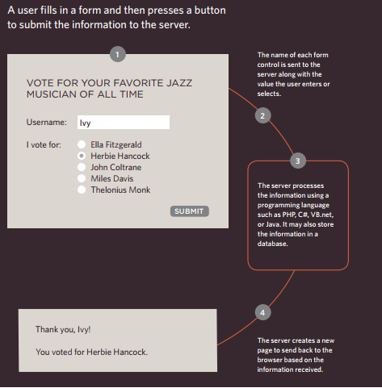
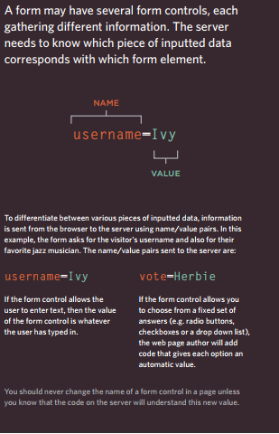

# Chapter 7:Forms

## Traditionally, the term 'form' has referredto a printed document that contains spaces for you to fill in information

## Form Controls

- ADDING TEXT:
  - Text input (single-line)
  - Password input
  - Text area (multi-line)
- MAKING ChOICES:
  - Radio buttons
  - Checkboxes
  - Drop-down boxes
- Submitting Forms:
  - Submit buttons
  - Image buttons
- Uploading Files:

## How Forms Work    

## Summary:
  - Whenever you want to collect information from visitors you will need a form  which lives inside a `<form>` element.
  - Information from a form is sent in name/value pairs.
  - Each form control is given a name, and the text the user types in or the values of the options they select are sent to the server.
  - HTML5 introduces new form elements which make it easier for visitors to fill in forms.
  
------------------------------------

# Chapter 14: Lists, TabLes and Forms

## Bullet Point styLes: __list-style-type__
  - Unordered Lists: 
     - none
     - disc
     - circle
     - square
  - Ordered Lists 
    - decimal
    - decimal-leading-zero
    - lower-alpha
    - upper-alpha
    - lower-roman
    - upper-roman

## Images For Bullets: __list-style-image__
## Positioning The Marker: __list-style-psition
  - Inside
  - Outside

## List Shorthand: __list-style__
  - inside circle

## Table Properties
## Border on Empty cells: __empty-cells__
  - show
  - hide
  - inherit

## Gaps between cells: __border-spacing, border-collapse__
  - collapse
  - separate

## Summary:
  * In addition to the CSS properties covered in other chapters which work with the contents of all elements, there are several others that are specifically used to control the appearance of lists, tables, and forms.
  * List markers can be given different appearances using the list-style-type and list-style image properties.
  * Table cells can have different borders and spacing in different browsers, but there are properties you can use to control them and make them more consistent.
  * Forms are easier to use if the form controls are vertically aligned using CSS.
  * Forms benefit from styles that make them feel more interactive.
