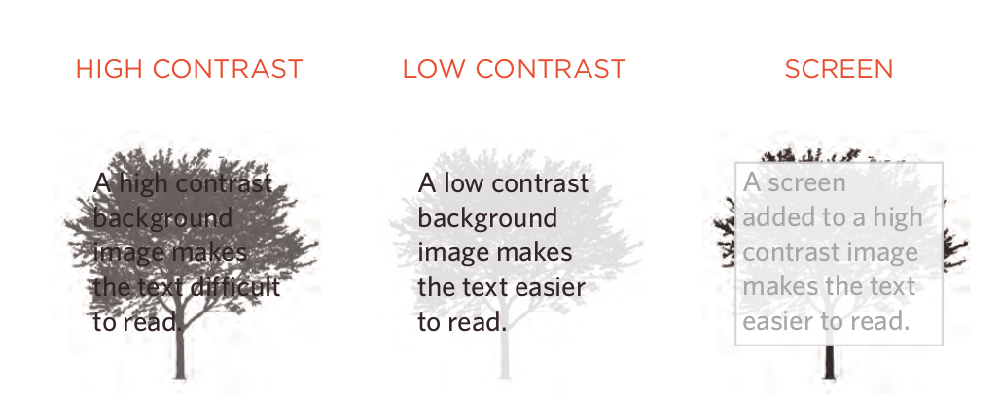

# Chapter 16: Images

## Controlling sizes of Article images in CSS

### You can control the size of an image using the width and height properties in CSS, just like you can for any other box.

## Aligning images Article Using CSS

### We can align image to left or right by using float property

## Centering  images Using CSS

### By default, images are inline elements. This means that they flow within the surrounding text. In order to center an image, it should be turned into a block- level element using the display property with a value of block.

### Once it has been made into a block-level element, there are two common ways in which you can horizontally center an image:

#### 1: On the containing element, you can use the text-align property with a value of center .

#### 2: On the image itself, you can use the use the margin property and set the values of the left and right margins to auto .

## Background Images (background-image)

### Bydefault, a background image will repeat to fill the entire box.

## Repeating images

### The background-repeat property can have four values:

   * repeat
   * repeat-x
   * repeat-y
   * no-repeat

### The background-attachment property specifies whether a background image should stay in one position or move as the user scrolls up and down the page. It can have one of two values:

  * fixed
  * scroll

## Background Position (background-position)

### Background Position can be one of these valuse:
   *left top
   *left center
   *left bottom
   *center top
   *center center
   *center bottom
   *right top
   *right center
   *right bottom

## Article CSS3: Gradients background-image

## Contrast of background images

## Summary

  * You can specify the dimensions of images using CSS. This is very helpful when you use the same sized images on several pages of your site.

  * Images can be aligned both horizontally and vertically using CSS.
  * You can use a background image behind the box created by any element on a page.
  * Background images can appear just once or be repeated across the background of the box.
  * You can create image rollover effects by moving the
background position of an image.
  * To reduce the number of images your browser has to
load, you can create image sprites.

---------------------------------

# Chapter 19:Practical information

## Search Engine Optimization (seo)

### The Basics
#### SEO is often split into two areas:
    * **on-page techniques**
    * **off-page techniques**.

on-page techniques | off-page techniques.
------------------ | --------------------
On-page is a method to improve the rating of my page. | Getting other sites to link to you
is just as important as on-page techniques
SEO depends on terms that people going to search | They are particularly interested in sites whose content is related to yours.
There are seven places where you want your keywords to appear So, Ensuring that any img have appropriate text in the value of alt. | Search engines also look at the
words between the opening `<a>` tag and closing `</a>` tag in the link.

## ON-Page SEO

### In every page of your website there are seven key places where keywords can appear in order to improve its findability.
  * Page title
  * url / WeB address
  * headings
  * text
  * link text
  * image alt text
  * Page descriPtions

## How to identify keyWords and Phrases
  * 1: Brainstorm
  * 2: organize
  * 3: research
  * 4: compare
  * 5: refine
  * 6: map

## FTP & third Party tools
### To transfer your code and images from your computer to your hosting company, you use something known as File Transfer Protocol.

### Here is a list of some popular FTP applications:
   * FileZilla
   * FireFTP
   * CuteFTP
   * SmartFTP
   * Transmit

## Summary

  * Search engine optimization helps visitors find your sites when using search engines.
  * Analytics tools such as Google Analytics allow you to see how many people visit your site, how they find it, and what they do when they get there.
  * To put your site on the web, you will need to obtain a domain name and web hosting.
  * FTP programs allow you to transfer files from your local computer to your web server.
  * Many companies provide platforms for blogging, email newsletters, e-commerce and other popular website tools (to save you writing them from scratch).